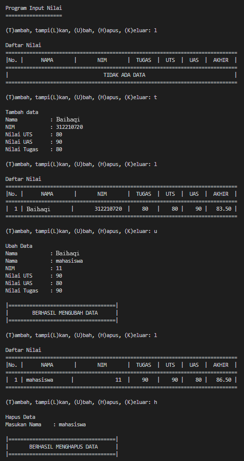
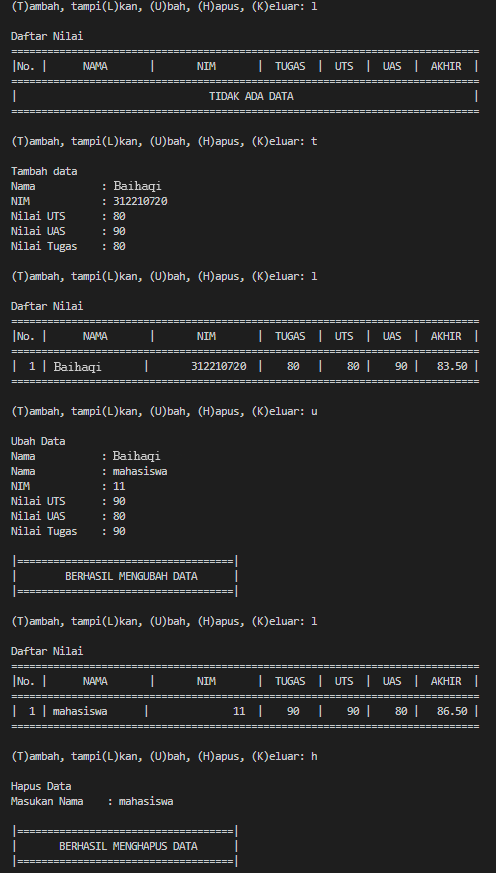
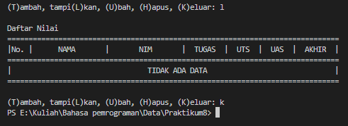

# Tugas Praktikum 10

### Program Data Mahasiswa

Pada praktikum kali ini, kita akan membuat program sederhana untuk membuat data mahasiswa menggunakan class, fungsi dan Dictionary dengan python.

#### Program Praktikum

``` python
x = {}

class data():
    def __init__(self,nama,nim,uts,uas,tugas,akhir):
        print("Program Input Nilai")
        print("="*19)
        while True:
            c = input("\n(T)ambah, tampi(L)kan, (U)bah, (H)apus, (K)eluar: ")
            if c.lower() == 't':
                self.tambah()
            elif c.lower() == 'l':
                self.tampilkan()
            elif c.lower() == 'u':
                self.ubah()
            elif c.lower() == 'h':
                self.hapus()
            elif c. lower() == 'k':
                break
            else:
                print("Pilih menu yang tersedia")
    
    def tambah(self):
        print("\nTambah data")
        self.nama = input("Nama           : ")
        self.nim = int(input("NIM            : "))
        self.uts = int(input("Nilai UTS      : "))
        self.uas = int(input("Nilai UAS      : "))
        self.tugas = int(input("Nilai Tugas    : "))
        self.akhir = self.tugas*30/100 + self.uts*35/100 + self.uas*35/100
        x[self.nama] = self.nim, self.tugas, self.uts, self.uas, self.akhir


class mahasiswa(data):
    def tampilkan(self):
        if x.items():
            print("\nDaftar Nilai")
            print("="*78)
            print("|No. |      NAMA       |       NIM       |  TUGAS  |  UTS  |  UAS  |  AKHIR  |")
            print("="*78)
            i = 0
            for z in x.items():
                i += 1
                print("| {no:2d} | {0:15s}| {1:15d}  | {2:5d}   | {3:5d} |{4:6d} | {5:7.2f} |"
                    .format(z[0][:13], z[1][0], z[1][1], z[1][2], z[1][3], z[1][4], no=i))
                print("=" * 78)
        else:
            print("\nDaftar Nilai")
            print("="*78)
            print("|No. |      NAMA       |       NIM       |  TUGAS  |  UTS  |  UAS  |  AKHIR  |")
            print("="*78)
            print("|                                TIDAK ADA DATA                              |")
            print("="*78)
    
    def hapus(self):
        print("\nHapus Data")
        self.nama = input("Masukan NIM    : ")
        if self.nama in x.keys():
            del x[self.nama]
            print()
            print("|====================================|")
            print("|       BERHASIL MENGHAPUS DATA      |")
            print("|====================================|")
        else:
            print("NIM {0} Tidak Ditemukan".format(self.nama))

    def ubah(self):
        print("\nUbah Data")
        self.nama = input("Nama           : ")
        if self.nama in x.keys():
            del x[self.nama]
            self.nama = input("Nama           : ")
            self.nim = int(input("NIM            : "))
            self.uts = int(input("Nilai UTS      : "))
            self.uas = int(input("Nilai UAS      : "))
            self.tugas = int(input("Nilai Tugas    : "))
            self.akhir = self.tugas*30/100 + self.uts*35/100 + self.uas*35/100
            x[self.nama] = self.nim, self.tugas, self.uts, self.uas, self.akhir
            print()
            print("|====================================|")
            print("|        BERHASIL MENGUBAH DATA      |")
            print("|====================================|")
        else:
            print("Nama {0} tidak ditemukan".format(self.nama))
    
run = mahasiswa("nama", "nim", "uts", "uas", "tugas", "akhir")
```
### Hasil Output




#### Penjelasan 

1.) Pertama kita membuat sebuah dictionary kosong yang nantinya akan diinputkan data ketika program dijalankan.
```python
x = {}
```

2.) Lalu membuat class data
```python
class data():
```

3.) Membuat fungsi menu
```python
def __init__(self,nama,nim,uts,uas,tugas,akhir):
        print("Program Input Nilai")
        print("="*19)
        while True:
            c = input("\n(T)ambah, tampi(L)kan, (U)bah, (H)apus, (K)eluar: ")
            if c.lower() == 't':
                self.tambah()
            elif c.lower() == 'l':
                self.tampilkan()
            elif c.lower() == 'u':
                self.ubah()
            elif c.lower() == 'h':
                self.hapus()
            elif c. lower() == 'k':
                break
            else:
                print("Pilih menu yang tersedia")
```
Apabila kita input 't' maka sistem akan memanggil fungsi tambah, bila kita input 'l' maka sistem akan memanggil fungsi tampilkan, bila kita input 'u' maka sistem akan memanggil fungsi ubah, bila kita input 'h' maka sistem akan memanggil fungsi hapus, nila 'k' maka sistem akan menghetikan pengulangan dan jika kita menginputkan selain yang ada pada menu (t, l, u, h, k) maka kita akan diminta untuk memilih menu yang tersedia.

4.) Membuat fungsi untuk mentambahkan data
```python
def tambah(self):
        print("\nTambah data")
        self.nama = input("Nama           : ")
        self.nim = int(input("NIM            : "))
        self.uts = int(input("Nilai UTS      : "))
        self.uas = int(input("Nilai UAS      : "))
        self.tugas = int(input("Nilai Tugas    : "))
        self.akhir = self.tugas*30/100 + self.uts*35/100 + self.uas*35/100
        x[self.nama] = self.nim, self.tugas, self.uts, self.uas, self.akhir
```

5.) Lalu membuat class mahasiswa dengan nilai class data
```python
class mahasiswa(data):
```

6.) Membuat fungsi untuk mentampilkan data
```python
def tampilkan(self):
        if x.items():
            print("\nDaftar Nilai")
            print("="*78)
            print("|No. |      NAMA       |       NIM       |  TUGAS  |  UTS  |  UAS  |  AKHIR  |")
            print("="*78)
            i = 0
            for z in x.items():
                i += 1
                print("| {no:2d} | {0:15s}| {1:15d}  | {2:5d}   | {3:5d} |{4:6d} | {5:7.2f} |"
                    .format(z[0][:13], z[1][0], z[1][1], z[1][2], z[1][3], z[1][4], no=i))
                print("=" * 78)
        else:
            print("\nDaftar Nilai")
            print("="*78)
            print("|No. |      NAMA       |       NIM       |  TUGAS  |  UTS  |  UAS  |  AKHIR  |")
            print("="*78)
            print("|                                TIDAK ADA DATA                              |")
            print("="*78)
```

7.) Membuat fungsi untuk menghapus data
```python
def hapus(self):
        print("\nHapus Data")
        self.nama = input("Masukan Nama    : ")
        if self.nama in x.keys():
            del x[self.nama]
            print()
            print("|====================================|")
            print("|       BERHASIL MENGHAPUS DATA      |")
            print("|====================================|")
        else:
            print("NIM {0} Tidak Ditemukan".format(self.nama))
```

8.) Membuat fungsi untuk mengubah data
```python
def ubah(self):
        print("\nUbah Data")
        self.nama = input("Nama           : ")
        if self.nama in x.keys():
            del x[self.nama]
            self.nama = input("Nama           : ")
            self.nim = int(input("NIM            : "))
            self.uts = int(input("Nilai UTS      : "))
            self.uas = int(input("Nilai UAS      : "))
            self.tugas = int(input("Nilai Tugas    : "))
            self.akhir = self.tugas*30/100 + self.uts*35/100 + self.uas*35/100
            x[self.nama] = self.nim, self.tugas, self.uts, self.uas, self.akhir
            print()
            print("|====================================|")
            print("|        BERHASIL MENGUBAH DATA      |")
            print("|====================================|")
        else:
            print("Nama {0} tidak ditemukan".format(self.nama))
```

9.) Membuat syntax untuk menjalanakan class mahasiswa dengan nilai "nama", "nim", "uts", "uas", "tugas", "akhir"
```python
run = mahasiswa("nama", "nim", "uts", "uas", "tugas", "akhir")
```
